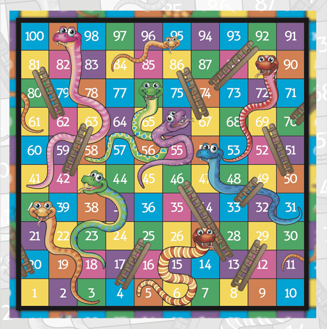
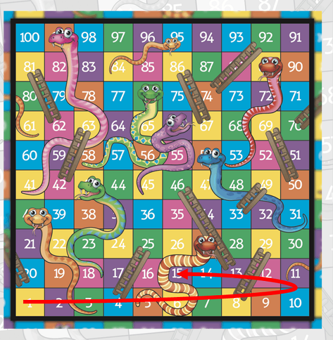
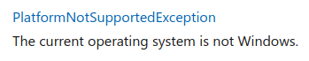

# Projeto 1 de Linguagens de Programação | 2021/2022

## Introdução

Os grupos devem implementar o jogo **Snakes & Ladders** na forma de uma
aplicação de consola .NET Core. O jogo deve ser PvP (_Player vs Player_), sem
qualquer tipo de inteligência artificial.

## Regras do Jogo

O jogo **Snakes & Ladders** é um jogo simples que depende exclusivamente dos
dados. O jogo consiste numa "corrida" onde o objetivo é ser o primeiro a chegar
à ultima casa do tabuleiro. O projeto a implementar será uma variação deste
jogo.



**Na versão a implementar** o tabuleiro consiste numa sequencia de 25 "casas"
de vários tipos, que podem afetar a posição do jogador no tabuleiro (ver secção
[Tipos de Casas](#tipos-de-casas)). O movimento consiste avançar a peça que
representa cada jogador o número de casas equivalente ao que foi obtido no
lançamento dos dados.



### Mecânicas do Tabuleiro

Nesta implementação do **Snakes and Ladders** o jogo irá começar sempre com um
tabuleiro aleatório onde o posicionamento dos diferentes tipos de casas irá
seguir uma regra específica definida em baixo.

O tabuleiro é uma matriz de 5 x 5 (i.e. 5 casas por linha e coluna), onde cada
jogador percorre uma linha até ao fim, para chegar à linha seguinte (ou seja
uma progressão horizontal).

### Jogadores e Avanços no Tabuleiro

O jogo é jogado com 2 jogadores.

A cada turno um jogador lança um dado de 6 lados, e avança o número de casas
equivalente ao valor obtido. Se o jogador cair numa **casa especial**, a regra
associada a essa casa é ativada imediatamente. Se a casa especial obrigar o
jogador a mover-se para outra casa especial, aplica-se novamente a regra
associada à nova casa, e por ai fora, até que o jogador calhe numa casa normal.
Assim que o jogador cair numa casa normal, será a vez de jogar do próximo jogador.

### Casos Especiais

* Se o jogador calhar numa casa onde já está outro jogador, o oponente é forçado a
retroceder uma casa. Caso se trate de uma casa especial, aplica-se a respetiva regra
ao jogador oponente.

* Caso o jogador ultrapasse o número necessário para chegar à última casa, terá de
  retroceder o número de casas equivalente ao valor que saiu a mais nos dados.
  * Por exemplo: faltam 2 casas para o João ganhar. Se tiver 5 no dado que lançou,
    irá retroceder 3 (5-2) casas, contando a partir da ultima casa do tabuleiro.

### Tipos de Casas

Existem 8 tipos de casas diferentes, as quais têm regras especificas de como
podem ser colocadas no tabuleiro:

* **Normal** - Casa normal sem regras especiais. A **primeira** e a **ultima** 
  casa do tabuleiro têm que ser obrigatóriamente normais.
* **Snakes** - Esta casa faz com que o jogador retroceda uma casa na **vertical**
  (ou seja, ande para trás 5 posições). Têm de existir entre 2 a 4 casas deste
  tipo no tabuleiro, aleatoriamente colocadas.
* **Ladders** - Esta casa faz com que o jogador avance uma casa na **vertical**
  (ou seja, ande para a frente 5 posições). Têm de existir entre 2 a 4 casas
  deste tipo no tabuleiro, aleatoriamente colocadas.
* **Cobra** - Esta casa obriga o jogador a voltar ao início do tabuleiro. Tem de
  existir apenas 1 casa deste tipo no tabuleiro, aleatoriamente colocada, embora
  não possa ser colocada nas duas primeiras linhas (i.e., as duas linhas de baixo).
* **Boost** - Esta casa obriga o jogador a avançar duas casas. Podem existir
  entre 0 a 2 casas deste tipo no tabuleiro, aleatoriamente colocadas, embora não
  possam ser colocadas na última linha (i.e., na linha de cima).
* **U-Turn** - Esta casa obriga o jogador a retroceder duas casas. Podem existir
  entre 0 a 2 casas deste tipo no tabuleiro, aleatoriamente colocadas, embora não
  possam ser colocadas na primeira linha (i.e., na linha de baixo).
* **Extra Die** - Esta casa oferece um dado extra ao jogador, que pode fazer uso
  do mesmo em qualquer altura do jogo, antes de lançar o(s) dado(s). Tem de
  existir uma casa deste tipo, aleatoriamente colocada.
  **Importante**: Um jogador nunca pode ter mais do que 1 dado extra de reserva.
  Caso caia novamente na casa _Extra Die_ e ainda não tenha usado o seu dado
  extra, a casa comporta-se como uma casa normal.
* **Cheat Die** - Esta casa oferece um dado "especial", dando a possibilidade de
  substituir um valor de um dado por um escolhido pelo jogador (valores de 1 a 6).
  A pergunta é feita após o jogador ter lançado o dado normalmente, e caso não
  goste do valor que calhou, pode então optar por usar o dado especial.
  Têm de existir 1 casa deste tipo no tabuleiro.
  **Importante**: (1) O jogador perde imediatamente esta opção depois de a
  utilizar. (2) esta opção não pode ser usada ao mesmo tempo que o _extra Die_
  (ou seja, caso o jogador tenha usado um _extra die_ antes da jogada, não
  terá a oportunidade de usar o _cheat die_ nessa mesma jogada).

Cada posição do tabuleiro só pode ter no máximo uma casa especial.

### Visualização

Toda a parte visual é feita na consola, e a cada turno é necessário mostrar o estado
do tabuleiro aos jogadores, indicando a posição corrente dos jogadores, as casas
especiais e os dados _extra_ e _cheat_ que o jogador tenha.

É essencial que a visualização tenha uma legenda que indique o significado das casas
e peças no tabuleiro.

Para ser fácil perceber o que acontece numa dada jogada, deve ser impressa uma
descrição da última jogada efetuada, por exemplo:

```
Player 1: die = 4; advanced 4 positions to a U-Turn special location; moved back 2 positions to a normal location; player 2 was there and was moved back 1 position to a normal location.
```

Podem e devem fazer uso de cores e carateres unicode para melhorar e clarificar o
aspeto visual do jogo.

## Funcionamento da Aplicação

O funcionamento exato da aplicação é da responsabilidade de cada grupo. No
entanto, quando a aplicação começa, **deve ser claro como cada jogador joga**,
ou seja, o jogo deve ter instruções muito claras sobre que teclas fazem o quê.
A legenda com indicação do significado das casas e das peças no tabuleiro é
essencial. Por outras palavras, os grupos devem ter em conta as regras importantes
do _game design_, pois serão tidas em conta na avaliação do projeto. **Sugerimos
fortemente que em primeiro lugar implementem o jogo em papel / fisicamente, de
modo a entenderem as regras, e só depois comecem a programar.**

A aplicação deve funcionar em Windows, macOS e Linux. A melhor estratégia para
garantir que assim seja é testar o jogo em Linux (e.g., numa máquina virtual).
Algumas instruções incompatíveis com macOS e Linux são, por exemplo:

* [Console.Beep()](https://docs.microsoft.com/dotnet/api/system.console.beep)
* [Console.SetBufferSize()](https://docs.microsoft.com/dotnet/api/system.console.setbuffersize)
* [Console.SetWindowPosition()](https://docs.microsoft.com/dotnet/api/system.console.setwindowposition)
* [Console.SetWindowSize()](https://docs.microsoft.com/dotnet/api/system.console.setwindowsize)
* Entre outras.

As instruções que só funcionam em Windows têm a seguinte indicação na sua
documentação:



### Organização e estrutura do código

O projeto deve estar devidamente organizado em métodos / funções e fazer uso de
enumerações. Os aluno mais avançados podem fazer uso de classes e _structs_, mas
tal não é obrigatório para este projeto. Cada classe, _struct_ ou enumeração deve
ser colocada num ficheiro com o mesmo nome. Por exemplo, uma enumeração chamada
`LocationType` deve ser colocada no ficheiro `LocationType.cs`. A estrutura do
código deve ser bem pensada e organizada de uma forma lógica. Por exemplo, deve
ser muito simples alterar o código para que o tabuleiro tenha outras dimensões,
e que possa ter mais ou menos casas especiais.

## Objetivos e critério de avaliação

Este projeto tem os seguintes objetivos:

* **O1** - Programa deve funcionar como especificado e deve ter em conta as
  regras básicas do _game design_. Podem ir adicionando funcionalidades como
  indicado de seguida, e a nota final de 4 valores está limitada da seguinte forma
  (considerando que os objetivos O2 a O5 sejam cumpridos):
  * Máximo de **2.0 valores**: apenas implementaram casas normais (neste caso
    o jogo é um simples jogo de corrida com dados).
  * Máximo de **2.4 valores**: apenas implementaram as casas especiais _Snakes_
    e _Ladders_.
  * Máximo de **2.6 valores**: implementaram também a casa especial _Cobra_.
  * Máximo de **2.8 valores**: implementaram também a casa especial _Boost_.
  * Máximo de **3.0 valores**: implementaram também a casa especial _U-Turn_.
  * Máximo de **3.5 valores**: implementaram também a casa especial _Extra Die_.
  * Máximo de **4 valores**: Funcionamento total, com todas as regras especiais
    implementadas, incluindo o _Cheat Die_.
* **O2** - Projeto e código bem organizados, nomeadamente:
  * Estrutura de classes bem pensada (ver secção [Organização e estrutura do
    código](#organização-e-estrutura-do-código)).
  * Código devidamente comentado e indentado.
  * Inexistência de código "morto", que não faz nada, como por exemplo
    variáveis, propriedades ou métodos nunca usados.
  * Projeto compila e executa sem erros e/ou *warnings*.
* **O3** - Projeto adequadamente documentado com [comentários de documentação
  XML][XML].
* **O4** - Repositório Git deve refletir boa utilização do mesmo, nomeadamente:
  * Devem existir *commits* de todos os elementos do grupo, _commits_ esses
    com mensagens que sigam as melhores práticas para o efeito (como indicado
    [aqui](https://chris.beams.io/posts/git-commit/),
    [aqui](https://gist.github.com/robertpainsi/b632364184e70900af4ab688decf6f53),
    [aqui](https://github.com/erlang/otp/wiki/writing-good-commit-messages) e
    [aqui](https://stackoverflow.com/questions/2290016/git-commit-messages-50-72-formatting)).
  * Ficheiros binários não necessários, como por exemplo todos os que são
    criados nas pastas `bin` e `obj`, bem como os ficheiros de configuração
    do Visual Studio (na pasta `.vs` ou `.vscode`), não devem estar no
    repositório. Ou seja, devem ser ignorados ao nível do ficheiro
    `.gitignore`.
  * *Assets* binários necessários, como é o caso da imagem do fluxograma, devem
    ser integrados no repositório em modo Git LFS.
* **O5** - Relatório em formato [Markdown] (ficheiro `README.md`),
  organizado da seguinte forma:
  * Título do projeto.
  * Autoria:
    * Nome dos autores (primeiro e último) e respetivos números de aluno.
    * Informação de quem fez o quê no projeto. Esta informação é
      **obrigatória** e deve refletir os *commits* feitos no Git.
    * Indicação do repositório Git utilizado. Esta indicação é
      opcional, pois podem preferir manter o repositório privado após a
      entrega.
  * Arquitetura da solução:
    * Descrição da solução, com breve explicação de como o código foi
      organizado, bem como dos algoritmos não triviais que tenham sido
      implementados.
    * Um fluxograma, indicando a sequência lógica de passos efetuados no código.
  * Referências, incluindo trocas de ideias com colegas, código aberto
    reutilizado (e.g., do StackOverflow) e bibliotecas de terceiros
    utilizadas. Devem ser o mais detalhados possível.
  * **Nota:** o relatório deve ser simples e breve, com informação mínima e
    suficiente para que seja possível ter uma boa ideia do que foi feito.
    Atenção aos erros ortográficos e à correta formatação [Markdown], pois
    ambos serão tidos em conta na nota final.

O projeto tem um peso de 4 valores na nota final da disciplina e será avaliado
de forma qualitativa. Isto significa que todos os objetivos têm de ser
parcialmente ou totalmente cumpridos. A cada objetivo, O1 a O5, será atribuída
uma nota entre 0 e 1. A nota do projeto será dada pela seguinte fórmula:

*N = 5 x O1 x O2 x O3 x O4 x O5 x D*

Em que *D* corresponde à nota da discussão e percentagem equitativa de
realização do projeto, também entre 0 e 1. Isto significa que se os alunos
ignorarem completamente um dos objetivos, não tenham feito nada no projeto ou
não comparecerem na discussão, a nota final será zero.

## Entrega

O projeto deve ser entregue por **grupos de 2 a 3 alunos** via Moodle até às
**23h de 1 de Abril de 2022**. Um (e apenas um) dos elementos do grupo deve ser
submeter um ficheiro `zip` com a solução completa, nomeadamente:

* Pasta escondida `.git` com o repositório Git local do projeto.
* Ficheiro da solução (`.sln`).
* Pasta do projeto, contendo os ficheiros `.cs` e o ficheiro do projeto
  (`.csproj`).
* Ficheiro `README.md` contendo o relatório do projeto em formato [Markdown].
* Ficheiro de imagem contendo o fluxograma. Este ficheiro deve ser incluído
  no repositório em modo Git LFS.
* Outros ficheiros de configuração, como por exemplo `.gitignore` e
  `.gitattributes`.

Não serão avaliados projetos sem estes elementos e que não sejam entregues
através do Moodle.

## Honestidade académica

Nesta disciplina, espera-se que cada aluno siga os mais altos padrões de
honestidade académica. Isto significa que cada ideia que não seja do
aluno deve ser claramente indicada, com devida referência ao respetivo
autor. O não cumprimento desta regra constitui plágio.

O plágio inclui a utilização de ideias, código ou conjuntos de soluções
de outros alunos ou indivíduos, ou quaisquer outras fontes para além
dos textos de apoio à disciplina, sem dar o respetivo crédito a essas
fontes. Os alunos são encorajados a discutir os problemas com outros
alunos e devem mencionar essa discussão quando submetem os projetos.
Essa menção **não** influenciará a nota. Os alunos não deverão, no
entanto, copiar códigos, documentação e relatórios de outros alunos, ou dar os
seus próprios códigos, documentação e relatórios a outros em qualquer
circunstância. De facto, não devem sequer deixar códigos, documentação e
relatórios em computadores de uso partilhado, e muito menos usar
repositórios Git públicos (embora os mesmos possam ser tornados públicos
12h após a data limite de submissão).

Nesta disciplina, a desonestidade académica é considerada fraude, com
todas as consequências legais que daí advêm. Qualquer fraude terá como
consequência imediata a anulação dos projetos de todos os alunos envolvidos
(incluindo os que possibilitaram a ocorrência). Qualquer suspeita de
desonestidade académica será relatada aos órgãos superiores da escola
para possível instauração de um processo disciplinar. Este poderá
resultar em reprovação à disciplina, reprovação de ano ou mesmo suspensão
temporária ou definitiva da ULHT.

*Texto adaptado da disciplina de [Algoritmos e
Estruturas de Dados][aed] do [Instituto Superior Técnico][ist]*

## Licenças

* Este enunciado é disponibilizado através da licença [CC BY-NC-SA 4.0].

## Metadados

* Autores: [Phil Lopes] e [Nuno Fachada]
* Curso:  [Licenciatura em Videojogos][lamv]
* Instituição: [Universidade Lusófona de Humanidades e Tecnologias][ULHT]

[CC BY-NC-SA 4.0]:https://creativecommons.org/licenses/by-nc-sa/4.0/
[lamv]:https://www.ulusofona.pt/licenciatura/videojogos
[Phil Lopes]:https://github.com/worshipcookies
[Nuno Fachada]:https://github.com/fakenmc
[ULHT]:https://www.ulusofona.pt/
[aed]:https://fenix.tecnico.ulisboa.pt/disciplinas/AED-2/2009-2010/2-semestre/honestidade-academica
[ist]:https://tecnico.ulisboa.pt/pt/
[Markdown]:https://guides.github.com/features/mastering-markdown/
[Doxygen]:https://www.stack.nl/~dimitri/doxygen/
[DocFX]:https://dotnet.github.io/docfx/
[KISS]:https://en.wikipedia.org/wiki/KISS_principle
[XML]:https://docs.microsoft.com/dotnet/csharp/codedoc
[SRP]:https://en.wikipedia.org/wiki/Single_responsibility_principle
[2º projeto de LP1 2018/19]:https://github.com/VideojogosLusofona/lp1_2018_p2_solucao
